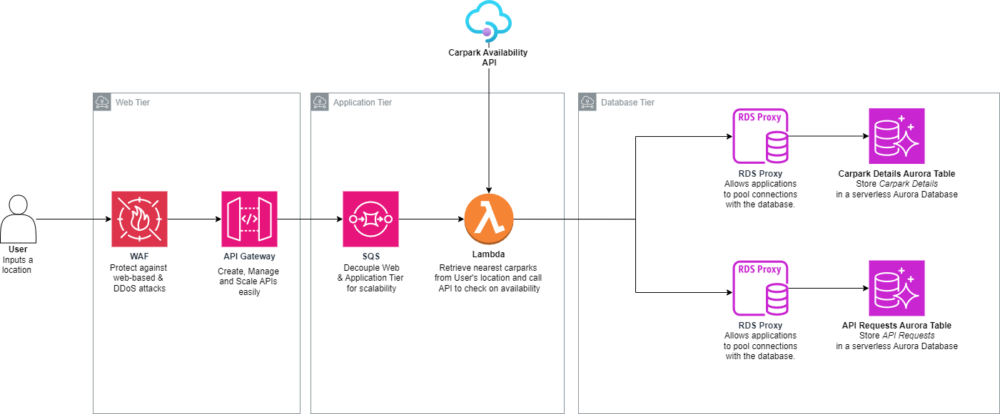

# Carpark Availability API - AWS Services Documentation

## Introduction
This document outlines the AWS services used in the Carpark Availability API architecture and their roles.

## AWS Services

Combining a few AWS services, we have a fully serverless, scalable and cost-optimised AWS architecture.

### 1. AWS WAF (Web Application Firewall)

Purpose: Protects the Carpark Availability API from common web exploits and provides security against various types of attacks, such as SQL injection and cross-site scripting (XSS).

### 2. Amazon API Gateway
Purpose: Acts as the entry point for the Carpark Availability API, handling incoming HTTP requests from clients and routing them to the appropriate backend services. It has throttling abilities to prevent overwhelming the backend services.

### 3. AWS Lambda
Purpose: Executes serverless functions in response to events triggered by API Gateway or other AWS services.

### 4. AWS SQS (Simple Queue Service)
Purpose: Helps to decouple the Web and Application Tier. Lambda functions have a maximum concurrency limit of 1000, so by adding an infinitely-scalable SQS queue, we ensure that the Lambda function is not overwhelmed.  

### 5. RDS Proxy (Relational Database Service Proxy)
Purpose: Provides a highly available, scalable, and secure database proxy for Amazon RDS (Relational Database Service) instances.By pooling together connections, it helps reduce overhead costs.

### 6. Amazon RDS - Aurora (Relational Database Service)
Purpose: Managed relational database service that simplifies database setup, operation, and scaling. Aurora is fully serverless and can perform auto-scaling.

## Workflow

### Reads (Checking Availability)

User will send a API request via a mobile-based application, which will go through WAS WAF before interacting with API Gateway. API GW enqueues a message to a SQS FIFO queue. A Lambda function will poll from the queue, and then performs a few tasks.

1) Input Validation 
2) API Key Verification
3) Calls the "Carpark Details" Aurora table and the "Carpark Availability" API. It then computes the nearest available carpark to the user.

The Lambda function then returns the information to the API Gateway, where Method Response or Integration Response can modify the response accordingly (such as adding correct HTTP status codes) before returning to the user.

### Writes (Chope-ing the Parking Lots)

User will send a API request via a mobile-based application, which will go through WAS WAF before interacting with API Gateway. API GW enqueues a message to a SQS FIFO queue. A Lambda function will poll from the queue, and then performs a few tasks.

1) Input Validation 
2) API Key Verification
3) Sends a POST request to the Carpark Availability API (to indicate a reservation request).
4) Upon receiving a response, it will write the reservation to the "API Requests" Aurora table and also send a response to API GW, back to the user.

## Handling Error/Edge Cases

**Error Cases**

The Lambda function will perform validation checks on the user's inputted location. If the location is invalid, it will respond with an error.

## Addressing Costing, Performance & Scalability

**Costing**

The Carpark Availability API leverages AWS cloud services, which follow a pay-as-you-go pricing model. This means that you only pay for the resources and services you use, without incurring any upfront costs or long-term commitments.

With AWS, there are no expenses associated with maintaining physical infrastructure, such as servers and data centers, reducing operational overhead and capital expenditures.

Additionally, AWS offers cost optimization tools and features, such as AWS Cost Explorer and AWS Trusted Advisor, to help monitor, analyze, and optimize your usage, ensuring cost-efficiency and budget control.

**Performance**

AWS services are designed for high availability, reliability, and performance.

For instance, AWS Lambda offers scalable compute capacity that automatically adjusts to match the demand, ensuring consistent performance under varying workloads.

In the testing phase of the architecture, manual scaling would be used to test the infrastructure and keep costs minimal. In the actual deployment, auto-scaling would be used to automatically scale out in times of high demand.

**Scalability**

The Carpark Availability API architecture is designed for scalability, leveraging AWS services that can be scaled independently to meet changing demands.

The fully serverless architecture means there is less manual involvement in maintaining, provisioning and scaling of the architecture.

## Database Schema

**Carpark Details**
| Field                  | Data Type          | Description                     |
|------------------------|--------------------|---------------------------------|
| car_park_no            | String             | Car park number                |
| address                | String             | Address of the car park        |
| x_coord                | Float              | X-coordinate of the car park   |
| y_coord                | Float              | Y-coordinate of the car park   |
| car_park_type          | String             | Type of car park               |
| type_of_parking_system | String             | Type of parking system         |
| short_term_parking     | String             | Availability of short-term parking |
| free_parking           | String             | Availability of free parking   |
| night_parking          | String             | Availability of night parking  |
| car_park_decks         | Integer            | Number of car park decks       |
| gantry_height          | Float              | Height of the gantry            |
| car_park_basement      | Integer            | Number of car park basements   |

**Carpark Availability**

| Field           | Data Type          | Description                     |
|-----------------|--------------------|---------------------------------|
| timestamp       | DateTime           | Timestamp of the data           |
| carpark_number  | String             | Car park number                 |
| total_lots      | Integer            | Total number of parking lots    |
| lot_type        | String             | Type of parking lot             |
| lots_available  | Integer            | Number of available parking lots|
| update_datetime | DateTime           | Timestamp of the update         |

## Possible Additions

1. Monitoring and Alerting:

Set up comprehensive monitoring and alerting for the Carpark Availability API using services like AWS CloudWatch. Monitor key metrics such as API latency, error rates, and resource utilization.

Configure alarms to notify of potential issues or anomalies in real-time, allowing for timely investigation and resolution.

## Other Considerations

If there are other drivers that took up the driving spots before our user got to their destination carpark, then the user needs to know about it. This could be implemented in this manner:
1) Since our reservations are written to the API Requests Aurora table, we have a persistent record of our users. 
2) A new Lambda function can be configured with a cron schedule to run, etc. every minute, to check if the carpark lots are indeed available. 
3) If the carpark was deemed to have no more lots, then the Lambda could publish to a SNS queue, which could inform the user via their selected notification method, be it SMS/Email/Push Notification from ParkingGoWhere.

It is important to note that unless reservations are enforced, the mobile app acts as more of a notification/information service, rather than a booking service.

Caching was deemed inappropriate due to the frequent updates to carpark availability. Instead, employing RDS replicas can effectively distribute the workload and diminish latency.

In the event that the application goes global, AWS CloudFront can be placed in front of the APIGW to make it globally accessible with low latency.

In the case of static assets being required (etc. images of the carparks), S3 is a convenient and simple service to store them.

If there is a need for high write throughput and scalability, database sharding can be used.

## Conclusion
This concludes the documentation for the AWS services used in the Carpark Availability API architecture and their roles. By leveraging these services, the Carpark Availability API offers a scalable, reliable, and secure solution for managing carpark availability data.

## API Table

| Endpoint                           | Method | Description                                                  |
|------------------------------------|--------|--------------------------------------------------------------|
| /api/carparks                     | GET    | Retrieve a list of all available carparks and their details. |
| /api/carparks/{carpark_id}        | GET    | Retrieve details of a specific carpark by ID.               |
| /api/carparks/search              | GET    | Search for carparks based on user-provided criteria (e.g., location, availability). |
| /api/carparks/reserve             | POST   | Reserve a parking lot for a specified duration.             |
| /api/carparks/reservations       | GET    | Retrieve a list of all reservations made by the user.      |
| /api/carparks/reservations/{reservation_id} | GET    | Retrieve details of a specific reservation by ID.      |
| /api/carparks/reservations/{reservation_id} | PUT    | Update details of a specific reservation (e.g., extend reservation duration). |
| /api/carparks/reservations/{reservation_id} | DELETE | Cancel a specific reservation by ID.                        |

questions 1) shoudl i add a cache layer? does it make sense given how fast the carpark info is updated? 2) does sqs make sense here for decoupling? i already have rds proxy. 3) how shoudl i partition the table? 3) how to make the api globally available? 4) is s3 needed for static assets?